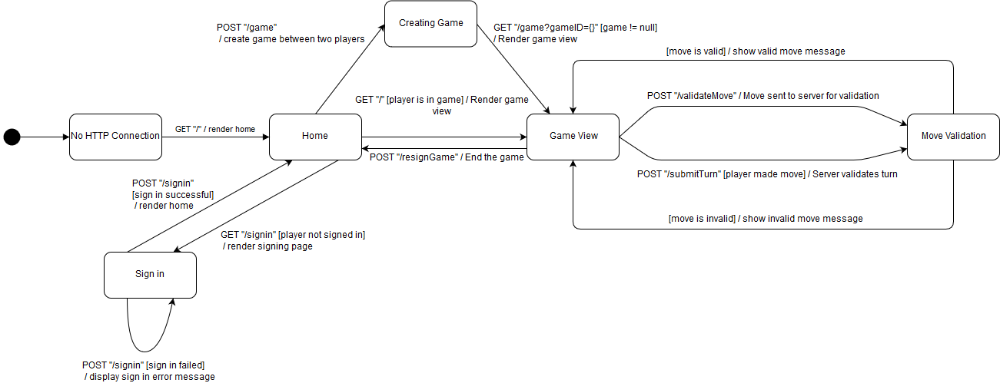

# PROJECT Design Documentation

## Team Information
* Team name: The B Team
* Team members:
>  * Jessica Brock-Schlageter
>  * Drake Busdiecker
>  * Paul Adler
>  * Montgomery Watts
>  * Daniel Murray

## Executive Summary

### Purpose
The goal of this project is to allow checkers players to connect with one another through online games using this
web application, and for the online experience to be just as good as checkers in the real world.

### Glossary and Acronyms
(All classes, methods and variables are self explanatory so far)

| Term | Definition |
|------|------------|
|  |  |

## Requirements

This section describes the features of the application.

> _Users of WebCheckers must be able to play a game of checkers
> that is in accordance with the American Rules. Users will first sign in
> and claim a username, after which no other user may take this username.
> During the game of checkers, either player may forfeit at any time, ending the game._

### Definition of MVP
> _The Minimally Viable Product allows users to play a full game of checkers with opponents that follows the American Rules._

### MVP Features
> * Start Game: Players are able to start games with other players.

> * Take Turn: Players are properly notified when it is their turn so they may take it.

> * Move: Players are able to move their pieces.

> * Jump: Players are able to jump their opponent's pieces.

> * King: Players are able to king their pieces by reaching the opposite end of the board.

> * Backup: Players are able to backup any moves they have made during their turn.

> * Resign: Players are able to resign from a game.

> * Win Game: Players are able to win the game by capturing all of their opponents pieces.

### Roadmap of Enhancements
> * Multiple Games
> * Asynchronous Play
> * Spectator Mode
> * Replay Mode
> * Player Help
> * Tournament Play
> * AI Player

## Application Domain

This section describes the application domain.

> _The game of checkers as a whole is made up of a board. This board consists of an
> 8x8 grid of spaces, half of which are white, and the other half of which are black. 
> Black spaces are the only spaces that may house pieces, and pieces may be either single or
> king pieces. Pieces are perhaps the most important entity, as much of the game's logic depends
> on the position of the pieces on the Board. Whether a move or jump move can be made, or if either
> is even valid is dependent on the pieces' position and which player the piece belongs to._

## Architecture and Design

This section describes the application architecture.

### Summary

The following Tiers/Layers model shows a high-level view of the webapp's architecture.

As a web application, the user interacts with the system using a
browser.  The client-side of the UI is composed of HTML pages with
some minimal CSS for styling the page.  There is also some JavaScript
that has been provided to the team by the architect.

The server-side tiers include the UI Tier that is composed of UI Controllers and Views.
Controllers are built using the Spark framework and View are built using the FreeMarker framework.  The Application and Model tiers are built using plain-old Java objects (POJOs).

Details of the components within these tiers are supplied below.

### Overview of User Interface

This section describes the web interface flow; this is how the user views and interacts
with the WebCheckers application.

> _Users begin at the home page. If they are not signed in, there will be an
element on the page indicating how many users are online. There is a navigation bar
that contains a link to a sign-in page. Once they click this link, they are redirected
to a page with a sign-in form. After submitting the form with a valid and available username, 
users will be redirect to the home page. The home page now contains a list of all players available 
to play with. Upon clicking on one of these players, the user will be redirect to the game page.
If it is the user's turn, they will have the option to drag and drop one of their pieces
onto a space. If this move is valid, the board will visually be updated, and if invalid, a message
indicating that the move is invalid will be displayed. At this point, the user may choose to
backup the move, which will return the piece to its original space, or submit their turn.
Upon submitting their turn, the controls will become disabled, and a message indicating that it is
the other user's turn will be displayed. This main gameplay loop is repeated until the game is finished.
At any point, the user may choose to resign the game, which will end the game pre-emptively, and return the
user to the homepage. In this case, the player who did not resign will see a message indicating that
their opponent has conceded._

### UI Tier
UI Tier Components:
> * GetHomeRoute: Provides a space for Players to see other Players,
 and start a game of checkers with them by clicking on them. Players that are currently assigned to a game
 will be redirected to GetGameRoute if they request GetHomeRoute.
 
> * GetSignInRoute: Provides a sign in form that allows users to claim
their username while they play.

> * PostSignInRoute: Checks to see if a username desired by a player 
is already claimed, or if it is invalid.

> * GetStopWatchingRoute: Cleans up after the spectator after they finish spectating a game

> * GetSpectatorGameRoute: Displays a game for the spectator to watch.

> * PostSpectatorCheckTurnRoute: Checks to see if the spectated game has changed its state so the spectator may refresh the board.

> * PostSignOutRoute: Signs a player out, allowing another user to claim their username.
 
> * PostGameRoute: Creates a game between two Players after
 one Player has clicked another on the home page.
 
> * GetGameRoute: Retrieves a game by gameID and properly displays it to the Players.
 
> * PostCheckTurnRoute: Tells a Player when it is their turn, so they may take their turn.

> * PostValidateMove: Tells a Player whether their latest move is valid, so they can comply
with the American rules.

> * PostSubmitTurnRoute: Applies all moves made by a Player to the CheckersGame, so their
turn can persist throughout the game.

> * PostBackupRoute: Allows a Player to take back their latest move.

> * PostResignRoute: Allows a Player to concede defeat and end a game.

### Application Tier
> * PlayerLobby: Responsible for keeping track of what players are online and validating usernames.

> * GameCenter: Responsible for the storage and retrieval of CheckersGames.

> * MoveValidation: Responsible for ensuring that moves made by Players follow the American rules.

### Model Tier
> * Board: Represents the state of the CheckersGame board.

> * CheckersGame: Represents the overall state of the game, such as previous board states made
in the current turn.

> * ModelPiece: Represents a checkers piece, whether it be a single piece or a king piece.

> * ModelSpace: Represents one space on the Board, and determines whether a ModelPiece may be placed on it
or if it currently has a piece.

> * Move: Represents the beginning and ending coordinates of a piece after a move.

> * Player: Represents a user in the CheckersGame. 

> * Position: Represents the coordinates used by Move.

### Design Improvements
> _One of the design improvements that should be implemented is more 
> widespread use of constants. Much of the logic behind the CheckersGame 
> and its associated classes depends on knowing the size of the board. If for
> some reason a user wanted to play with a board that had a size other than 8, 
> the codebase would have to be changed in at least a dozen places. If there was 
> a single constant that all of this logic depended on, it would only have to be changed once.
> Another design improvement would be better encapsulation. Many classes have intimate knowledge
> of other classes, and there are many instances of chaining. Rather than calling
> `spaces[row][col].getPiece().getColor().equals(activeColor)` there should be a method
> like `getColorAt(row, col)` that would can then be used to check for equality. 
> This would improve readability, as well as abstract away how the actual function is implemented
> from calling classes. There are also variables that are repeated between Model classes such
> as the Player attributes in the CheckersGame and Board classes. It should only be necessary for
> these to be declared in one place. Code style is all over the place, with enum names being all
> lowercase, and method names being a mix of snake case and camel case such as `CheckersGame_creation_red()`._

## Testing
> _The tests were often run through manually first then unit/integration tests were written after. One example may be
> the deadlock endgame scenario. A large list of moves was run through manually, when it would make more sense to create 
> tests that stepped though all of the moves programmatically. Our methodology of testing the functionality manually then
> writing the unit tests is the opposite of test-driven development. It would be better to specify what should happen
> in given scenarios, so that the code is written to match these specifications._

### Acceptance Testing
> _All MVP stories pass their acceptance tests. The spectator story enhancement does not sort by
> win rate, as was requested by the client. However, the winrate is displayed. The win percentage
> individual players is used to calculate this percentage, but their individual win rates are not displayed by themselves._

### Unit Testing and Code Coverage
> _We didn't have a unit testing strategy. The code coverage of the code base achieved through
> our unit testing was 69%. There weren't coverage targets, it was just decided that ~70% was good enough,
> as long as it worked._
